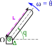
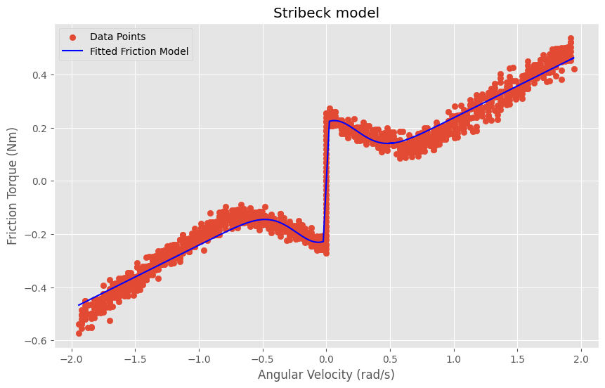

# 📖 Report
## ⁉️ Specifigcations

First, let us introduce the ins and outs of the subject at hand: the anti-gravity arm. That is, we present what was demanded of us and why, and what was expected to come out of this work.

### Context 

This project was conducted in the context of the development of the robot Reachy, created by Pollen Robotics. This humanoid robot aimed to be **interacting with humans**, which poses **security problematics**. Indeed, the arms of the Reachy are articulated using Dynamixel servomotors ; those are controlled using position command which uses maximum torque. Thus, the positioning of both arms may cause injuries if done improperly. To solve such issues, a **control using torque command** can be implemented. That is why the project was proposed to us.

### Existing matter

A complete model of the Reachy was lent to us for this project. The main developper on this part of the project, Remi Fabre, also gave us a link to a repository of a [firmware](https://github.com/RhobanProject/Dynaban) he, and some other developers of the Rhoban team, developed a few years ago.

During this project, we will use the **motors** of the Reachy's shoulder (**MX-64** and **MX-106**), and the **pypot python library**. 

### Goal 

We implemented an **anti-gravity "finger"**, that is a one degree of freedom arm. Because of a lack of time, we are only able to give leads for the implementation of a two-degree of freedom solution. The **expected output** is a program that when launched, enables position control with torque command on the finger.

## 🔎 Implemented approch

Now, let's focus on the science which the project is based off ; on one hand, the project has been implemented following specific mathematical models. On a second hand, some constants appearing in the models priorly defined are to be emprically computed. A section containing all the notations is at disposal.

### 📑 Notations

|Symbole        |Definition     |Unit         
|---------------|---------------|------------
$PWM$ | PWM peak duty cycle | $\%$ 
$U$ | Motor tension | $V$ 
$U_{alim}$ | Power supply tension | $V$ 
$i$ | Current intensity in the motor | $
$e$ | Back EMF | $V$ 
$R$ | Motor resistance | $\Omega$ 
$K_m$ | Motor torque constant | $V.s.rad^{-1}$ 
$\omega$ | Angular velocity | $rad.s^{-1}$ 
$\omega_s$ | Stribeck velocity | $rad.s^{-1}$ 
$T_m$ | Motor torque | $N.m$ 
$T_s$ | Inertial torque | $N.m$ 
$T_f$ | Friction torque | $N.m$ 
$f_s$ | Stiction torque | $N.m$
$f_C$ | Dynamic friction torque | $N.m$
$b$ | Viscous friction constant | $kg.m^2.s^{-1}$
$J_\Delta$ | Moment of inertia of the solid | $kg \cdot m^2$ 
$V$ | Solid's volume | $m^3$ 
$r_\Delta$ | Distance to each point from the solid's rotation axis $\Delta$ | $m$ 
$\rho$ | Material density | $kg.m^{-3}$ 
$m$ | Arm mass | $kg$ 
$dm$ | Elementary mass | $kg$ 
$l$ | Solid's height | $m$ 
$e$ | Solid's thickness | $m$ 
$L$ | Solid's length | $m$ 

### 📐 The mathematics behind it all 

#### ⚛️ Physics

The finger is crafted with a Dynamixel motor MX-106. Attached to its shaft is a metal ruler of known dimensions $l\times L \times e$ and mass $m$.

The situation can be modelled as a rectangular prism attached to its end to the motor shaft as presented on the following figure :

</img>

Figure of the model

The torque needed by the motor to overcome gravity is the following :
$$T_m = T_s + T_f$$

where $T_s$ a nd $T_f$ are respectively the inertial torque and the friction torque.

In this situation, the intertial torque is the following:

$$T_s = -m\ g\ G\ cos(q)$$

where $G$ is the center of mass. This one can also be expressed along the following equation :

$$G = \dfrac{1}{m} {\int\int\int}_V \rho(r)r_\Delta\mathrm{d}V $$

In the case of a homogeneously distributed ruler, one gets the following:

$$\dfrac{1}{m} {\int\int\int}_V \rho(r)r_\Delta\mathrm{d}V = \dfrac{el\rho}{m} \int_0^L r_\Delta\mathrm{d}r = \dfrac{L}{2}$$

So the actual inertial torque in this model can be expressed as follows:

$$T_s = -m\ g\ \dfrac{L}{2} cos(q)$$

The friction torque can be modelled according to different models, more or less complex. We decided to go for the Coulomb-Stribeck equation which is composed of two main compounds : a term combining the two types of Coulomb friction, that is stiction and dynamic friction ; and a term for viscous friction. The equation is the following:

$$T_{f}=f_{C}\operatorname{sgn}({\omega})+(f_{s}-f_{C})e^{-\left({\omega}/{\omega_s}\right)^{2}}+b{\omega} 
$$

* $f_s$ corresponds to the stiction torque, that is the torque needed to overcome the static friction ;
* $f_C$ corresponds to the dynamic friction torque, that is the torque needed to counter the dynamic friction;
* $w_s$ is the Stribeck velocity;
* $b$ is the viscous friction coefficient.
  
Notably, the viscous friction torque at a constant non-zero speed can be expressed as follows :

$$T_m = b \omega$$

#### 🦾 Electronics
 
Once the physical models are understood, it is time to link them to the underlying electronics models. That is, to send a torque command to a motor, we need to communicate with it in a way it understands. The three main equations to remember are the following ones :

* Motor torque and link with its current 
$$ T_m = K_m i $$

* Motor tension
$$ U = Ri + e $$

* Back EMF
$$e = K_m \omega_m $$

In these equations, $K_m$ is the motor torque constant and $R$ is the motor resistance. With this in mind, one can control the motor either in tension command or in current command, with a values that are computed based on a target torque. The two possible commands are:

* Tension command : $U = \dfrac{R T_m}{K_m} + e$

* Current command : $i = \dfrac{T_m}{K_m}$

### ⚙️ The motor caracterization

#### Motor constants

The previous equations contain constants that are specific to each unit of motors. They need to be identified.

We started by identifying the motor's constants that is, identifying $K_m$ and $R$. For $R$, a basic read of value using an Ohm-meter was conducted.

For $K_m$, we relied on the equation $U = Ri + K_m \omega$; we sampled values of tension and according angular velocity on an empty motor and performed a linear regression. We thus tried to identify $m$ in a relation of the form $y=mx+p$ where $m=K_m$, $x=\omega$, $p=Ri$ and $U=y$.

Such calculations can be performed by calling the function `caraterize` from our python module `lib.py`.

#### Friction model

In the file `src/benchmark_torque.ipynb`, we tried to fit several models using `curve_fit` from `scipy.optimize`.

As discussed ealier, we opted for the Coulomb-Stribeck model which we managed to fit with satisfying results:

Further model fitting discussion are detailed in said file.

## 📈 Analysis of results

**Qualify** and **quantify** your achievements. Make measurements from your work, e.g.:

* **User tests**: Setup a methodology to test the efficiency of your project against users. It may use pre-experiment and post-experiment questionnaires. The most users the better to draw meaningful conclusions from your experiments. Radar diagrams are good to summarize such results.
* **Table of data**: Provide (short) extracts of data and relevant statistics (distribution, mean, standard deviation, p-values...)
* **Plots**: Most data are more demonstrative when represented as plots. 

Draw conclusions, **interpret** the results and make recommandations to your client for your future of the work.
It is totally fine to have results that are not as good as initially expected. Be honest and analyse why you did not manage to reach the objectives.
